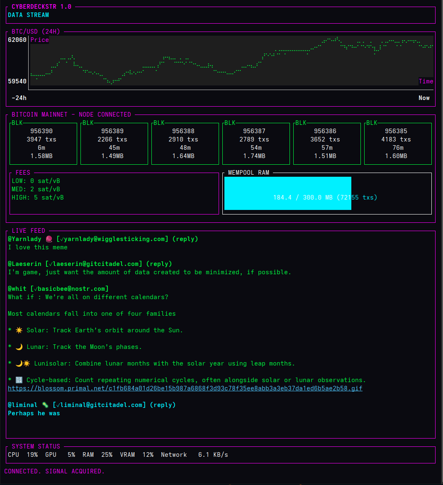

# CYBERDECKSTR

A high-fidelity, cyberpunk-aesthetic Nostr client for your terminal.



## Description

CYBERDECKSTR is a TUI (Terminal User Interface) client for the Nostr protocol, built in Rust. It is designed for those who prefer the command line and enjoy a bit of retro-future flair.

**Features:**
*   **Read-Only Feed:** Connects securely to Nostr relays.
*   **Identity Resolution:** Automatically resolves `npub` identities to display names.
*   **Cyberpunk UI:** Custom neon styling using `ratatui`.
*   **Lightning Fast:** Built on `tokio` for asynchronous performance.

## Installation

### Prerequisites
*   [Rust and Cargo](https://rustup.rs/)

### Build from Source

1.  Clone the repository:
    ```bash
    git clone https://github.com/davidjj999/cyberdeckstr.git
    cd cyberdeckstr
    ```

2.  Run the application:
    ```bash
    cargo run
    ```

3.  Build for release:
    ```bash
    cargo build --release
    ./target/release/cyberdeckstr
    ```

## Usage

1.  Launch the application.
2. Paste your **npub** (public key) when prompted (or configure it in `config.toml` for auto-login).
3. The client will jack into the matrix, fetch your follows, and display a live stream of their notes.

## Configuration (Optional)

You can create a `config.toml` file in the root directory to automate login and enable the **Bitcoin Blockchain Visualization**.

**To enable auto-login and Bitcoin metrics:**
1. Copy the example config:
   ```bash
   cp config.toml.example config.toml
   ```
2. Edit `config.toml` with your details:
   ```toml
   # Auto-login with your npub
   npub = "npub1..."

   # Bitcoin Node Connection (Optional)
   # Leave these blank or comment them out to disable the blockchain visualization
   node_address = "127.0.0.1:8332"
   node_username = "your_rpc_user"
   node_password = "your_rpc_password"
   ```

**Features enabled by configuration:**
- **Auto-Login:** Skips the manual entry screen.
- **Blockchain Visualization:** Replaces the standard price chart with a real-time dashboard showing blocks, fees, and mempool usage. Note: Requires a running Bitcoin Core node with RPC enabled.

## License

MIT
